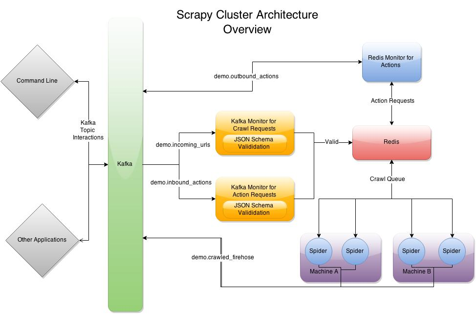

# Scrapy Cluster

This Scrapy project uses Redis and Kafka to create a distributed on demand scraping cluster.

The goal is to distribute seed URLs among many waiting spider instances, whose requests are coordinated via Redis. Any other crawls those trigger, as a result of frontier expansion or depth traversal, will also be distributed among all workers in the cluster.

The input to the system is a set of Kafka topics and the output is a set of Kafka topics. Raw HTML and assets are crawled interactively, spidered, and output to the log. For easy local development, you can also disable the Kafka portions and work with the spider entirely via Redis, although this is not recommended due to the serialization of of the crawl requests.

*Note as of 4/27/15:*

*An official tagged release is getting close, we are just trying to consolidate documentation and ensure everything works easily for new users. Thank you for your patience and interest! If you would like to jump right in anyways, the [Quick Start](quickstart.md) guide is complete.*

## Dependencies

Please see `requirements.txt` for Pip package dependencies across the different sub projects.

Other important components required to run the cluster

- Python 2.7: https://www.python.org/downloads/
- Redis: http://redis.io
- Zookeeper: https://zookeeper.apache.org
- Kafka: http://kafka.apache.org

## Core Concepts

This project tries to bring together a bunch of new concepts to Scrapy and large scale distributed crawling in general. Some bullet points include:

- The spiders are dynamic and on demand, meaning that they allow the arbitrary collection of any web page that is submitted to the scraping cluster
- Scale Scrapy instances across a single machine or multiple machines
- Coordinate and prioritize their scraping effort for desired sites
- Persist across scraping jobs or have multiple scraping jobs going at the same time
- Allows for unparalleled access into the information about your scraping job, what is upcoming, and how the sites are ranked
- Allows you to arbitrarily add/remove/scale your scrapers from the pool without loss of data or downtime
- Utilizes Apache Kafka as a data bus for any application to interact with the scraping cluster (submit jobs, get info, stop jobs, view results)

## Architecture Overview

